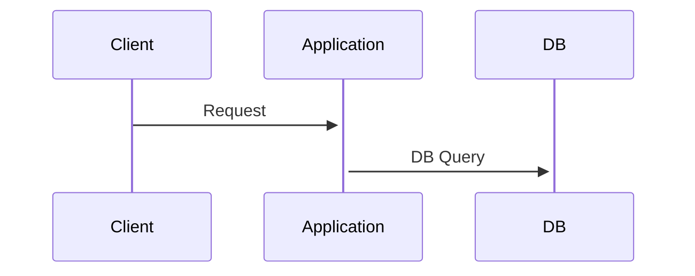
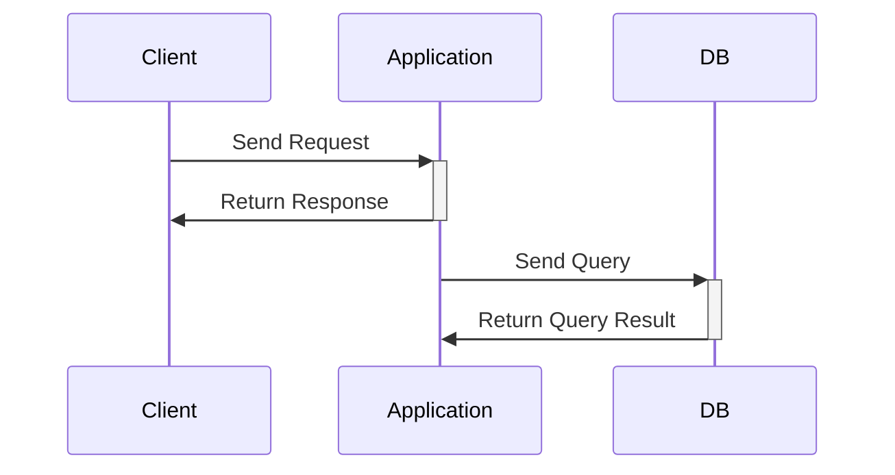
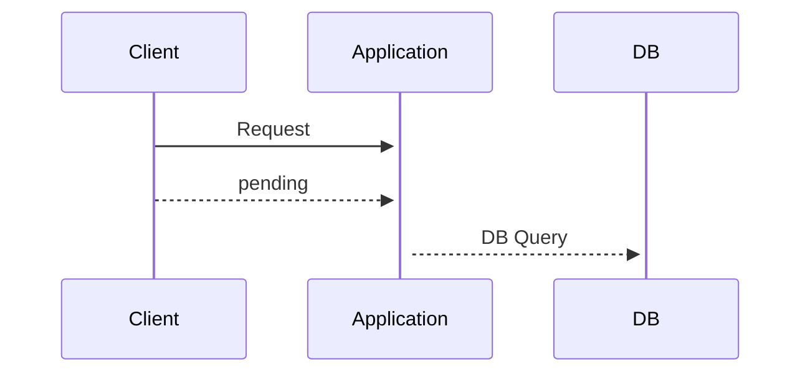

# Go Context的基本使用

此文章主要是用来介绍一下golang里面context的使用，因为之前一直不太清楚context的用法，以及context的一些基本特性。

<!--more-->

## Context的使用场景

[Context](https://pkg.go.dev/context#Context)的功能可以从两个方面去体现：

1. 发送终止信号去提供给方法
2. 传递一些公用的数据给多个方法

## 为什么需要取消操作（终止信号）

简单来说，我们需要一些终止信号，来告诉我们的程序去停止进行一些不必要的工作。

用一个简单的例子来说明：




从客户端发送请求到程序处理再到数据库中，正常流程如下图所示



但是当客户端发送请求后，如果断开链接，那么正常情况下后序的数据库查询操作应该停止，如果没有任何中止信号那么程序会继续执行，但是正常的情况是需要终止继续操作



所以我们就知道为什么需要终止信号了

## Go中Context终止信号发送方式

在go中有两个方面去实现终止信号

1. 监听终止事件
2. 发布终止事件

### 监听终止事件

Context提供了一个Done()的方法，该方法会返回一个channel，每次监听到上下文发送了取消事件的时候，都发送一个空的struct{}到该管道中，所以为了监听到取消事件，我们需要等待 <-ctx.Done()传递的信号量。

```Go
func TestListeningCancel(t *testing.T) {
	// 测试方法
	// 浏览器打开localhost:8000
	// 两秒之后会返回request processed
	// 如果发送请求后立刻断开那么 ctx.Done() 能够收到信号 执行中断
	http.ListenAndServe(":8000", http.HandlerFunc(func(w http.ResponseWriter, r *http.Request) {
		ctx := r.Context()
		fmt.Fprint(os.Stdout, "processing request\n")

		select {
		case <-time.After(2 * time.Second):
			// 2秒后要是收到信号
			// 说明请求被执行
			w.Write([]byte("request processed"))
		case <-ctx.Done():
			// 如果请求被取消 输出请求被取消
			fmt.Fprint(os.Stderr, "request cancelled")
		}
	}))
}

```

### 发送终止事件

如果你有一个操作要被取消，那么你需要通过上下文发送一个取消事件

我们可以通过Context包里的内置方法WithCancel(),该方法会返回一个context和一个function

`ctx,fn :=context.WithCancel()`

```go
// 这个方法是假设一个操作失败
func Operation1(ctx context.Context)error{
	time.Sleep(100 *time.Millisecond)
	return errors.New("failed")
}


func Operation2(ctx context.Context){
	select {
	case <-time.After(500*time.Millisecond):
		fmt.Println("done")
	case <-ctx.Done():
		fmt.Println("halted operation2")

	}
}

func TestEmittingCancel(t *testing.T){
	// 创建一个新的context
	ctx := context.Background()
	// 通过一个原始创建的ctx 将其包装成为一个新的，带有取消方法的ctx
	ctx, cancel := context.WithCancel(ctx)
	// 执行上面两个操作 ，让一个操作是在一个go routine中
	go func() {
		err := Operation1(ctx)
		if err!=nil{
			cancel()
		}
	}()

	// 执行2操作的时候一样用同样的ctx
	Operation2(ctx)
}
```

该示例就是演示，go有一个协程发送了取消的信号的时候，监听相同context的线程也可以收到信号，并执行操作

### 超时取消

context包也提供了一个超时取消的方法`context.WithTimeout`,该方法会在倒计时结束之后自动发送取消信号

```go
func TestCancelWithTimeout(t *testing.T){
	// 创建一个空ctx
	ctx := context.Background()
	// 设置超时时间
	cxt, _ := context.WithTimeout(ctx, 1*time.Millisecond)

	// 创建一个请求 访问谷歌
	req, _ := http.NewRequest(http.MethodGet, "http://baidu.com", nil)
	// 将带有取消方法的ctx和请求关联
	req = req.WithContext(cxt)

	client := &http.Client{}
	res, err := client.Do(req)
	if err!=nil{
		fmt.Println("Request failed:", err)
		return
	}
	fmt.Println("Response received, status code:", res.StatusCode)

}
```

### Context Values

当有多个操作需要用到同一个value的时候，context也提供了对应的方法，可以让多个执行方法获取到值，使用这样的方法进行值传递可以保证对改值的操作**是线程安全的**

```go
const keyID = "id"

func TestContextWithValue(t *testing.T) {
	rand.Seed(time.Now().Unix())
	ctx := context.WithValue(context.Background(), keyID, rand.Int())
	operation1(ctx)
}

func operation1(ctx context.Context) {
	log.Println("operation1 for id:", ctx.Value(keyID), " completed")
	operation2(ctx)
}

func operation2(ctx context.Context) {
	log.Println("operation2 for id:", ctx.Value(keyID), " completed")

}
```


以上就是context的一些基本操作，后序还需要进入深度研究