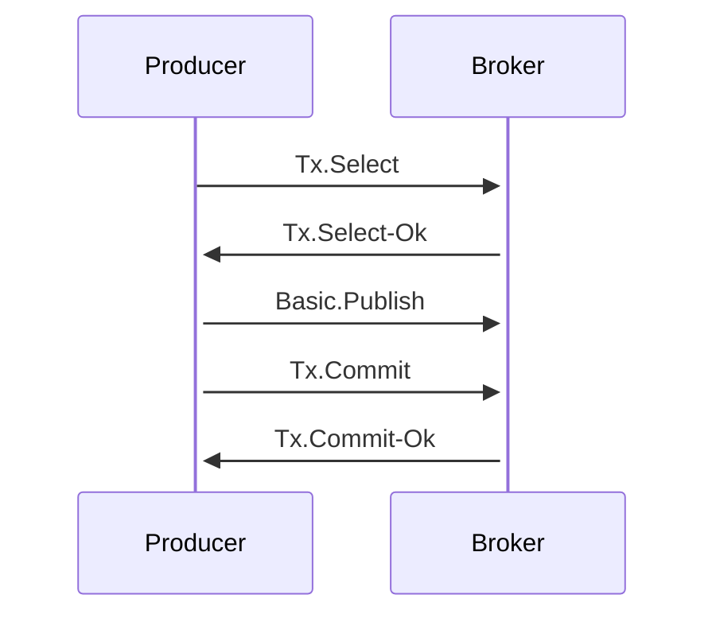
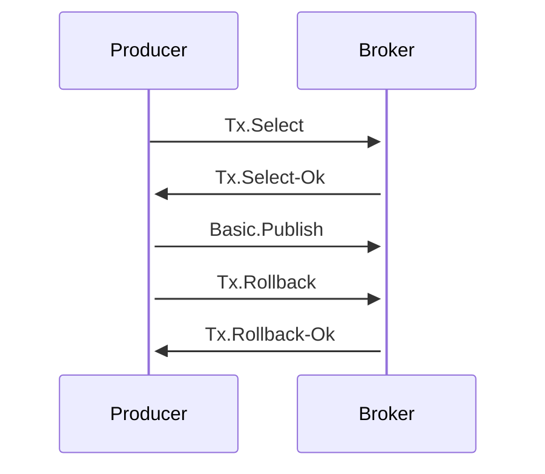

## Linux下一些rabbitmq的命令
```bash
systemctl start    rabbitmq-server   #启动
systemctl restart  rabbitmq-server   #重启
systemctl stop     rabbitmq-server   #停止
systemctl status   rabbitmq-server   #查看状态

```

```bash
rabbitmqctl list_users            #查看用户
rabbitmqctl list_queues           #查看队列
rabbitmqctl status                #查看borker状态
rabbitmqctl purget_queue 队列名称  #删除指定队列中数据
rabbitmqctl delete_queue 队列名称  #删除指定队列
rabbitmqctl help                  #帮助命令
rabbitmqctl add_user root root   #添加用户 username password
rabbitmqctl set_permissions -p / root ".*" ".*" ".*" #给root设置全部权限
rabbitmqctl set_user_tags root administrator #给root设置管理员角色
rabbitmqctl list_queues name messages_ready #查看ready 消息

```

```bash
rabbitmq-plugins list    #查看插件
rabbitmq-plugins enable  #启动插件
rabbitmq-plugins disable #停止插件
rabbitmq-plugins help    #帮助命令 

```

<!-- more -->

## RabbitMq运转流程

### 生产者
1. 连接到一个RabbitMQ Broker 建立一个连接，开通一个信道
2. 声明一个交换器，并设置相关属性，比如交换机的类型、是否持久化等
3. 声明一个队列并设置相关的属性，是否排他、是否持久化、是否自动删除等
4. 通过路由键将交换机和队列绑定
5. 生产者发送消息到RabbitMQ Broker 其中包含路由键、交换机等信息
6. 相应的交换机根据路由键查找相匹配的队列
7. 如果没有找到，则更具生产者配置属性选择丢弃或者回退给生产者
8. 关闭信道
9. 关闭连接
### 消费者
1. 连接到一个RabbitMQ Broker 建立一个连接，开通一个信道
2. 向RabbitMQ Broker请求消费相应队列中的消息，可能会设置相应的回调函数
3. 等待RabbitMQ Broker 回应并投递相应队列中的消息，消费者接受消息
4. 消费者确认（ACK）接受到的消息
5. RabbitMQ 从队列中删除相应已经确认的消息
6. 关闭信道
7. 关闭连接


信道是建立在Connection之上的虚拟连接，RabbitMQ处理每条AMQP指令都是通过信道来完成的

# 交换器和队列的使用
### channel.ExchangeDeclare 声明一个交换器
* name: 交换器名称
* kind: 交换器的类型 fanout,direct,topic,headers
* durable: 设置是否持久化，持久化可以将交换器存盘，那么在服务器重启的时候不会丢失相关信息
* autoDelete: 设置是否自动删除，自动删除的前提是至少有一个队列或者交换器与这个交换器绑定，之后所有的与这个交换器绑定的队列或者交换器都与此接棒
* internal : 是否是内置交换机 如果是内置的，那么客户端程序无法直接发送到这个交换器中，只能通过交换器路由到交换器的方式
* noWait: 不需要服务器返回，如果为true 表示需要等待服务器的返回（服务器会返回Exchange.Declare-Ok 这个AMQP命令）

### channel.ExchangeDeclarePassive 
用来检测相应的交换器是否存在，如果存在返回正常，不存在就返回error 同时channel会被关闭

### channel.ExchangeDelete
* ifUnused 用来设置交换器没有被使用的情况下删除，如果IfUnused设置为true，则只有此交换器没有被使用的情况下，才会被删除，如果设置false，则无论如何这个交换器都被删除

### channel.QueueDeclare 声明一个队列
* name: 队列名称
* durable: 是否持久化，持久化的队列会存盘，在服务器重启的时候保证不会丢失相关信息
* exclusive: 设置是否排他，为true则设置队列为排他的，如果一个队列被声明为排他队列，该队列仅首次声明他的连接可见，并且连接断开的时候自动删除
  * 排他队列是基于连接Connection可见的，同一个连接的不同信道可以同时访问同一个连接创建的排他队列
  * "首次"是指如果一个连接已经声明了一个排他队列，其他的连接是不允许建立同名的排他队列，这个与普通队列不同
  * 即使该队列是持久化的，一旦连接关闭或者客户端退出，该排他队列都会被自动删除，这种队列适用于一个客户端发送和读取消息的应用场景
* autoDelete: 设置是否自动删除，为true则设置队列为自动删除，自动删除的前提是：至少有一个消费者连接到这个队列，之后所有与这个队列连接的消费者断开的时候，才会自动删除，不可以把这个参数错误的理解为，"当连接到这个队列的所有客户端断开时，这个队列才会自动删除"，因为生产者客户端创建这个队列，或者没有消费者客户端与这个队列连接时，都不会删除这个队列

### channel.QueuePassive 
该方法用来检测相应的队列是否存在，如果存在则返回正常，如果不存在则会异常，同时channel也会被关闭

### channel.QueueDelete 
删除队列，ifUnused 和删除交换器参数一样

### channel.QueuePurge 
用来清空队列中的内容，而不是删除队列本身

### channel.QueueBind 将队列和交换器绑定
* name: 队列名称
* key: 绑定队列和交换器的routingKey
* exchange: 交换器名称

### channel.QueueBind 将队列和交换器解绑
* name: 队列名称
* key: 绑定队列和交换器的routingKey
* exchange: 交换器名称

# 发送消息
### channel.Publish 发送消息
* exchange: 交换机名称
* key: routingKey
* mandatory: 当设置为true的时候，交换器无法找到一个符合条件的队列的时候，RabbitMQ会调用Basic.Return命令将消息返回给生产者。当参数设置为false的时候，则会将消息丢弃
* immediate: 当参数设置为true的时候，如果交换器在消息路由到队列的时候发现队列上没有任何消费者，这个消息就不会进入队列，当路由键匹配的所有队列都没有消费者的时候，该消息会通过Basic.Return返回给生产者
* msg
  * DeliveryMode 消息投递模式 2 表示 持久化在服务器
  * Priority 优先级
  * ContentType 消息属性
  * Body 消息体
  * Headers 消息头
  * Expiration 消息过期时间

# 消费消息
**对于消息的消费有两种模式 一种是：推（PUSH）和拉（PULL），channel.Consume 是推，而channel.Get 是拉**
## 推模式
### channel.Consume 
* queue 队列名称
* consume consumeTag 同一个channel里消费者也需要通过唯一的消费者标签进行区分
* autoAck 是否自动确认，设置为false，然后显式的进行ack操作，可以防止消息不必要的丢失
* noLocal 设置为true则表示不能将同一个Connection中生产者发送的消息传递给这个Connection中的消费者
* exclusive 是否排他
* arg 其他参数

## 拉模式
### channel.Get
* queue 队列名称
* autoAck 自动确认

# 消费端的确认与拒绝
为了保证消息从队列中可靠的到达消费者，RabbitMQ提供了消息确认机制，所以在消费的方法中可以看到autoAck的参数，如果设置为false，那么需要消费端显式的进行消息确认，RabbitMQ会等待消费者回复了确认信号之后，才会把消息从内存（或者磁盘）中移除
（实质上是先对消息打上删除标志，之后再删除），但是如果autoAck为true的时候，不论消费者是否有成功消费，RabbitMQ都会再把消息发送出去之后，将消息进行删除

当autoAck设置为false的时候，对于RabbitMQ来说，队列中的消息分成了两个部分，一部分是等待投递的消息；一部分是已经投递的消息，但是还没有收到消费者的确认信号。如果RabbitMQ一直没有收到消费者的确认信号，并且消费此消息的消费者断开了连接，那么RabbitMQ则会
安排此消息重新进入队列，等待投递给下一个消费者，也有可能是原来的消费者

RabbitMQ不会未确认的消息设置过期时间，他判断消息是否需要重新投递的唯一依据就是判断消费者是否已经断开连接

在消费者接受到消息之后，如果想明确拒绝当前消息而不是确认，可以使用**channel.Reject**方法
### channel.Reject 拒绝消息
* tag 消息编号
* requeue 是否重新入队，如果是true，那么消息在被拒绝之后，会重新放入队列
  Reject一次只能拒绝一条消息，如果需要批量拒绝，那么需要时候Nack

### channel.Nack 批量拒绝消息
* tag
* requeue
* multiple 如果为false，则表示拒绝编号为tag的一条消息，这个时候效果和reject一样，如果为true，表示拒绝tag编号**之前**的所有未被当前消费者确认的消息

### channel.Recover 重新发送未被确认的消息
* requeue 如果设置为true 则未被确认的消息会被重新加入到队列中，对于同一条消息来说，可能会发送给不同的消费者，如果设置为false，那么同一个消息会被分配给之前相同的消费者。默认情况下，requeue为true


# 关闭连接
程序在使用完成之后需要关闭连接，释放资源，如果没有对channel显式的进行释放，那么在关闭connection的时候，channel也会被关闭
AMQP协议中的Connection和Channel采用同样的方式来管理网络失败、内部错误和显式关闭连接，生命周期如下：
* Open 开启状态，表示当前对象可用
* Closing 正在关闭状态，当前对象收到了一个关闭请求，同时也产生了一个让其内部对象也进行相对应的关闭操作，并且等待这些关闭操作完成
* Closed 已关闭,当前对象已经接收到了所有内部对象已完成关闭的通知，并且自身也关闭

# 消息的去从
RabbitMQ 提供备份交换机，可以将未能被交换器路由的消息(没有绑定队列或者没有匹配的绑定)存储起来，而不反悔给客户端
## mandatory参数
也就是说，如果消息发送出去之后，没有与之对应的RoutingKey 消息会被重新返回
```go 
    ret := channel.NotifyReturn(notifyReturn)
	go func() {
		for r := range ret {
			fmt.Println(string(r.Body))
		}
	}()
```

## immediate参数
当参数设置为true的时候，如果交换器在消息路由到队列的时候发现队列上没有任何消费者，这个消息就不会进入队列，当路由键匹配的所有队列都没有消费者的时候，该消息会通过Basic.Return返回给生产者
RabbitMQ3.0版本去除了对immediate的支持，建议采用TTL和DLX的方法代替

**总的来说 mandatory是在无法路由到queue的时候会把消息返回，而immediate是在路由到了之后，发现没有消费者的时候进行返回**

## 备份交换器
生产者在发送消息的时候如果不设置mandatory参数，那么消息在未被路由的情况下会丢失，然而如果设置了mandatory参数，就需要添加NotifyReturn参数，这个时候就会将生产者的代码逻辑变得复杂。
如果不想让生产者代码变复杂，又不想让消息丢失，那么就可以使用备份交换器，但是生产者和消费者都需要声明备用交换器。交换器会在消息无法路由到匹配的队列的时候
把消息发送到备用交换器绑定的队列中

```go 
        args := make(map[string]interface{})
	args["alternate-exchange"] = "myAe"
	// 声明一个exchange
	err = channel.ExchangeDeclare("normalExchange", amqp.ExchangeDirect, true, false, false, false, args)
	common.FailOnError(err, "failed to declare a exchange")
	// 声明一个备份交换器
	err = channel.ExchangeDeclare("myAe", amqp.ExchangeFanout, true, false, false, false, nil)
	common.FailOnError(err, "failed to declare a alternate-exchange")

	// 声明一个queue durable 持久化选项
	normalQueue, err := channel.QueueDeclare("normalQueue", true, false, false, false, nil)
	common.FailOnError(err, "failed to declare a queue")

	// 绑定一个norMalQueue到norMalExchange
	err = channel.QueueBind(normalQueue.Name, "normalKey", "normalExchange", false, nil)
	common.FailOnError(err, "failed to bind a queue")

	unRoutedQueue, err := channel.QueueDeclare("unRoutedQueue", true, false, false, false, nil)
	common.FailOnError(err, "failed to declare a unRouteQueue")

	err = channel.QueueBind(unRoutedQueue.Name, "", "myAe", false, nil)
	common.FailOnError(err, "failed to bind a myAe queue")

```
交换器的几种特殊情况：
1. 如果设置的备用交换器不存在，客户端和RabbitMQ服务端都不会出现异常，消息会丢失
2. 如果备份交换器没有绑定任何队列，客户端和RabbitMQ服务端都不会出现异常，消息丢失
3. 如果备份交换器没有任何匹配的队列，客户端和RabbitMQ服务端不会有异常出现，消息丢失
4. 如果备份交换器和mandatory参数一起使用，那么mandatory参数无效

## 过期时间(TTL)
### 设置消息的TTL
设置消息过期时间有两种方式
1. 设置队列的属性，这样的话队列里的消息过期时间都是同样的，如果生产者在声明的时候设置了过期时间，那么消费者在声明的时候同样需要进行声明。
再对队列设置过期时间的时候，因为每条消息的过期时间是一样的，所以已过期的消息肯定是在队列的头部，所以一旦消息过期，马上就会从队列中移除
```go 
args := make(map[string]interface{})
	args["x-message-ttl"] = 6000
	// 声明一个queue durable 持久化选项
	normalQueue, err := channel.QueueDeclare("ttlQueue", true, false, false, false, args)
	common.FailOnError(err, "failed to declare a queue")
```
2. 单独设置消息的过期时间，在针对每个消息进行设置过期时间的时候，消息的过期判断是在消息即将发送给消费者的时候进行判断，因为每一个消息的过期时间是不一样的，如果要及时进行过期清除，需要扫描整个队列。
所以，再对单个消息进行过期判断的时候其实是在消息即将发送出去的时候进行判断的
```go 
    msg := amqp.Publishing{
		ContentType: common.ContentTypeText,
		Body:        []byte("a ttl test"),
		Expiration:  "3000",
	}

```
3. 如果队列和单个消息都设置了过期时间，那么会以过期时间小的为准。
一旦超过设置的TTL的值的时候，消息就会变成"死信"，消费者将无法再次收到消息（但是这并不是绝对的）
### 设置队列的TTL
队列的过期，是表示队列上没有任何消费者，而且队列也没有被重新声明，并且在过期时间内没有调用过Basic.Get命令，RabbitMQ可以保证在过期时间到达之后队列被删除，
但是队列不一定会被立马删除。对于持久化的队列，会在RabbitMQ重启之后重新计算过期时间。
```go 
args := make(map[string]interface{})
	// 过期时间单位为毫秒
	args["x-expires"] = 10000
	// 声明一个queue durable 持久化选项
	normalQueue, err := channel.QueueDeclare("ttlQueue1", true, false, false, false, args)
```

## 死信队列
**DLX(Dead-Letter-Exchange)**，当一个消息在队列中变成死信之后，他能被重新发送到另一个交换器中（DLX),绑定DLX的队列就被称之为死信队列
消息变为死信的几种情况
1.消息被拒绝（Basic.Reject/Basic.Nack)，并且设置requeue参数为false；
2.消息过期
3.队列达到最大的长度
DLX其实就是一个正常的交换器，可以被任何一个队列绑定，当这个队列中存在死信的时候，RabbitMQ就会自动把消息重新发布到设置的DLX上，进而被路由到另一个队列（死信队列）
```go 
// 声明一个 dlx exchange
	err = channel.ExchangeDeclare("exchange.dlx", amqp.ExchangeDirect, true, false, false, false, nil)
	// 声明一个 normal exchange
	err = channel.ExchangeDeclare("exchange.normal", amqp.ExchangeFanout, true, false, false, false, nil)
	common.FailOnError(err, "failed to declare a exchange")

	args := make(map[string]interface{})
	args["x-dead-letter-exchange"] = "exchange.dlx"
	// 为死信队列指定路由键 如果没有指定，那么就是用原来的路由键
	args["x-dead-letter-routing-key"] = "dlx-routing-key"
	// 过期时间单位为毫秒
	// 声明一个 queue 并且为其绑定死信队列
	normalQueue, err := channel.QueueDeclare("queue.normal", true, false, false, false, args)
	common.FailOnError(err, "failed to declare a queue")
	// 绑定一个norMalQueue到norMalExchange
	err = channel.QueueBind(normalQueue.Name, "", "exchange.normal", false, nil)
	common.FailOnError(err, "failed to bind a queue")

	// 声明一个死信队列
	dlxQueue, err := channel.QueueDeclare("queue.dlx", true, false, false, false, nil)
	common.FailOnError(err, "failed to declare a queue")
	// 绑定
	err = channel.QueueBind(dlxQueue.Name,"dlx-routing-key","exchange.dlx",false,nil)
	common.FailOnError(err, "failed to bind a queue")
```

## 延迟队列
延迟队列就是消息到达队列之后，不会立即被消费者获取，而是在指定的时间之后，消费者才能拿到消息
在RabbitMQ中需要使用TTL和DLX模拟出延迟队列的效果

生产者代码(可优化)
```go 
err = channel.ExchangeDeclare("normal.delay.exchange", amqp.ExchangeDirect, true, false, false, false, nil)
	// 声明一个 dlx exchange
	err = channel.ExchangeDeclare("exchange.dlx.5s", amqp.ExchangeDirect, true, false, false, false, nil)
	err = channel.ExchangeDeclare("exchange.dlx.10s", amqp.ExchangeDirect, true, false, false, false, nil)
	err = channel.ExchangeDeclare("exchange.dlx.15s", amqp.ExchangeDirect, true, false, false, false, nil)
	// 声明一个 三个时间过期时间不一样的队列
	normal1, err := channel.QueueDeclare("exchange.normal.5", true, false, false, false, map[string]interface{}{
		"x-message-ttl":             5000,
		"x-dead-letter-exchange":    "exchange.dlx.5s",
		"x-dead-letter-routing-key": "dlx-routing-key-5",
	})
	common.FailOnError(err, "failed to declare a normal1")
	err = channel.QueueBind(normal1.Name, "normal.5", "normal.delay.exchange", false, nil)
	common.FailOnError(err, "failed to bind a normal1")

	normal2, err := channel.QueueDeclare("exchange.normal.10", true, true, false, false, map[string]interface{}{
		"x-message-ttl":             10000,
		"x-dead-letter-exchange":    "exchange.dlx.10s",
		"x-dead-letter-routing-key": "dlx-routing-key-10",
	})
	common.FailOnError(err, "failed to declare a normal2")
	err = channel.QueueBind(normal2.Name, "normal.10", "normal.delay.exchange", false, nil)
	common.FailOnError(err, "failed to bind a normal2")

	normal3, err := channel.QueueDeclare("exchange.normal.15", true, false, false, false, map[string]interface{}{
		"x-message-ttl":             15000,
		"x-dead-letter-exchange":    "exchange.dlx.15s",
		"x-dead-letter-routing-key": "dlx-routing-key-15",
	})
	common.FailOnError(err, "failed to declare a normal3")
	err = channel.QueueBind(normal3.Name, "normal.15", "normal.delay.exchange", false, nil)
	common.FailOnError(err, "failed to bind a normal2")

	// 绑定 dlx1
	delay1, err := channel.QueueDeclare("queue.5s", true, false, false, false, nil)
	common.FailOnError(err, "failed to declare a delay1")
	err = channel.QueueBind(delay1.Name, "", "exchange.dlx.5s", false, nil)

	// 绑定 dlx2
	delay2, err := channel.QueueDeclare("queue.10s", true, false, false, false, nil)
	common.FailOnError(err, "failed to declare a delay2")
	err = channel.QueueBind(delay2.Name, "", "exchange.dlx.10s", false, nil)

	// 绑定 dlx3
	delay3, err := channel.QueueDeclare("queue.15s", true, false, false, false, nil)
	common.FailOnError(err, "failed to declare a delay3")
	err = channel.QueueBind(delay3.Name, "", "exchange.dlx.15s", false, nil)

	// 构造一个msg
	firstMsg := amqp.Publishing{
		ContentType: common.ContentTypeText,
		Body:        []byte("a delay 5s message"),
	}
	err = channel.Publish("normal.delay.exchange", "normal.5", false, false, firstMsg)

	secondMsg := amqp.Publishing{
		ContentType: common.ContentTypeText,
		Body:        []byte("a delay 10s message"),
	}
	err = channel.Publish("normal.delay.exchange", "normal.10", false, false, secondMsg)

	thirdMsg := amqp.Publishing{
		ContentType: common.ContentTypeText,
		Body:        []byte("a delay 15s message"),
	}
	err = channel.Publish("normal.delay.exchange", "normal.15", false, false, thirdMsg)

	common.FailOnError(err, "failed to publish a msg")
```


消费者代码(可优化)
```go 

	err = channel.QueueBind("queue.5s", "dlx-routing-key-5", "exchange.dlx.5s", false, nil)
	err = channel.QueueBind("queue.10s", "dlx-routing-key-10", "exchange.dlx.10s", false, nil)
	err = channel.QueueBind("queue.15s", "dlx-routing-key-15", "exchange.dlx.15s", false, nil)
	common.FailOnError(err, "failed to bind a queue")

	firstMsg, err := channel.Consume("queue.5s", "", true, false, false, false, nil)
	secondMsg, err := channel.Consume("queue.10s", "", true, false, false, false, nil)
	thirdMsg, err := channel.Consume("queue.15s", "", true, false, false, false, nil)
	common.FailOnError(err, "failed to consume")

	go func() {
		for delivery := range firstMsg {
			fmt.Println(string(delivery.Body))
			fmt.Println(delivery.DeliveryTag)
			fmt.Println(delivery.RoutingKey)
		}
	}()
	go func() {
		for delivery := range secondMsg {
			fmt.Println(string(delivery.Body))
			fmt.Println(delivery.DeliveryTag)
			fmt.Println(delivery.RoutingKey)
		}
	}()
	go func() {
		for delivery := range thirdMsg {
			fmt.Println(string(delivery.Body))
			fmt.Println(delivery.DeliveryTag)
			fmt.Println(delivery.RoutingKey)
		}
	}()

	forever := make(chan interface{})
	<-forever
```

## 优先级队列
拥有最高优先级的队列具有高优先权利，优先级高的消息具备优先被消费的权利
```go 
	args := make(map[string]interface{})
    args["x-max-priority"] = 10
	// 声明一个 queue 并且设置其优先级
	normalQueue, err := channel.QueueDeclare("queue.priority", true, false, false, false, args)
    
    // 设置消息优先级
    msg := amqp.Publishing{
		ContentType: common.ContentTypeText,
		Body:        []byte("a high priority message"),
		Priority:    5,
	}
```

对于设置优先级来说，如果消费者消费的速度大于生产者生产的速度且Broker没有消息堆积的情况，那么其实优先级设置是没有意义的，因为队列里只会存在一条消息。

## RPC实现

## 持久化
持久化分为：交换器持久化、队列持久化、消息持久化
* 交换器的持久化只需要在声明交换器的时候把durable,对于交换器的持久化来说，交换器没有持久化，交换器的元数据会在RabbitMQ重启之后消失，但是对于消息来说不会丢失，只是不能继续把消息发送到这个交换器了
* 队列的持久化也是通过durable来进行设置的，如果队列没有设置持久化，那么在RabbitMQ重启之后，队列和数据都会丢失。但是队列的持久化也只能保证队列的元数据不会因为异常情况丢失，但是不能保证内部存储的消息不会丢失。要确保消息不丢失，必须把消息设置为持久化
* 消息的持久化可以通过设置消息的属性`DeliveryMode: amqp.Persistent`

设置了队列和消息的持久化，在RabbitMQ重启之后，消息依然存在。单单只设置队列持久化，在重启之后消息会丢失。单单设置消息持久化，重启之后队列丢失，其内部的消息也会丢失。
**如果对所有的消息进行持久化，会严重影响RabbitMQ的性能**

## 生产者确认
生产者确认其实就是为了，能够让生产消息的一方确认消息已经成功送达到了RabbitMQ服务器。RabbitMQ提供了两种方式解决该问题：
* 通过事务机制实现
* 通过发送方确认（publisher confirm）机制实现

### 事务机制
RabbitMQ客户端与事务机制相关的方法有三个：
* channel.Tx() 将当前信道设置为事务模式
* channel.TxCommit() 用于提交事务
* channel.TxRollback() 用于事务回滚

```go 
    body := "Hello World" 
	err = ch.Tx()
	common.FailOnError(err, "failed to begin a transaction")
	// 发布消息，
	err = ch.Publish(
		"", queue.Name, false, false, amqp.Publishing{
			ContentType: "text/plain",
			Body:        []byte(body),
		})
	common.FailOnError(err, "Fail to publish a Message")
	err = ch.TxCommit()
	common.FailOnError(err, "failed to commit a transaction")

```
对于开启事务来说，在开启和提交的时候都需要向RabbitMQ进行询问，在开启动作得到正确响应的时候
才会开始进行消息发送。同样，在提交的时候也是需要得到RabbitMQ的提交确认


```go 
    // 模拟回滚
	err = ch.Tx()
	common.FailOnError(err, "failed to begin a transaction")
	// 发布消息，
	err = ch.Publish(
		"", queue.Name, false, false, amqp.Publishing{
			ContentType: "text/plain",
			Body:        []byte(body),
		})
	num1 := 10
	num2 := 0
	_ = num1 / num2
	common.FailOnError(err, "Fail to publish a Message")
	err = ch.TxCommit()
	common.FailOnError(err, "failed to commit a transaction")
	defer func() {
		err := recover()
		if err != nil {
			common.FailOnError(err.(error), "app has error ")
			err2 := ch.TxRollback()
			common.FailOnError(err2, "failed to rollback a transaction")
		}
	}()

```


对于回滚来说其实是一样的


对于多消息的发送，只需要把commit嵌入循环即可
```go 
      body := "Hello World"
    err = ch.Tx()
    common.FailOnError(err, "failed to begin a transaction")
    // 发布消息
    for i := 0; i < 10; i++ {
    err = ch.Publish(
    "", queue.Name, false, false, amqp.Publishing{
    ContentType: "text/plain",
    Body:        []byte(body),
    })
    common.FailOnError(err, "Fail to publish a Message")
    err = ch.TxCommit()
    common.FailOnError(err, "failed to commit a transaction")
    }
```

这里的事务和一般的事务不太一样，这里的事务只要让信道开启就可以一直使用，而对于数据库的事务来说，
事务在提交之后，事务就结束了也就关闭了，如果还想继续事务则需要重新开启一个。然而事务的开启会损耗RabbitMQ的性能，通过消息确认机制可以解决这个问题
### 发送确认机制
事务机制的开启会降低RabbitMQ的吞吐量，这个时候RabbitMQ引入了一种 发送方确认的机制。
发送确认机制需要把信道设置为confirm模式（autoAck->false),在进入这个模式之后，每一条消息都会被指派一个唯一的ID（从1开始），一旦消息被投送到对应的队列之后，RabbitMQ就会发送一个
确认（Basic.Ack)给生产者（包含唯一消息ID），这就可以让生产者知道消息以及送达，如果消息和队列是可持久化的，那么确认消息会在写入磁盘之后发出。
RabbitMQ回传给生产者消息中的deliveryTag包含了确认消息的序号。RabbitMQ也可以设置multiple参数，表示到这个序号之前的消息都得到了处理。
```go 
  // 将信道设置为publisher confirm 模式
  err = channel.Confirm(false)
  
  //监听确认时候，RabbitMQ返回给生产者的消息唯一ID 从1开始
  ackAndNack := make(chan uint64)
	channel.NotifyConfirm(ackAndNack, ackAndNack)
	go func() {
		for u := range ackAndNack {
			fmt.Println(u)
		}
	}()

```

## 消费端

### 消息分发
当RabbitMQ队列拥有过个消费者的时候，队列收到的消息将以轮询的方式分发给消费者，默认情况下如果有n个消费者，RabbitMQ会将第M条消息，发送给第m%n(取余的方式)个消费者。
这样的话，假如当时那个消费者还负担太重，还来不及消费，而其他的消费者还属于空闲的状态。那么就会降低整个应用的吞吐量。
channel.Qos()可以设置信道上消费者所能保持的最大未确认消息的数量，当设置了Qos的时候，每一次消息抵达消费者。RabbitMQ会进行计数+1，当消费者确认了某条消息之后，计数才会-1
**Basic.Qos的使用对于拉模式的消费方式无效**
##### channel.Qos()
* prefetchCount 能够接受的未确认消息个数的上限 0表示没有上限
* prefetchSize  未确认消息的总体大小的上限 单位为B 0表示没有上限
* global 默认为false
  * false 信道上新的消费者需要遵从prefetchCount的限定值
  * true 信道上所有的消费者要遵从prefetchCount的限定值

### 消息顺序性
消息的顺序性是指，消费者消费的消息和发送者发布的消息顺序是一致的（不考虑消息重复的情况）。但是RabbitMQ没有办法很好地保证消息的顺序性
比如说：出现消息丢失，网络故障，多个生产者的情况（无法确定消息到达Broker的前后顺序）、延迟队列、事务、或者publish-confirm模式

## 消息传输保障
消息传输保障一般是业务系统接入的时候需要考虑的问题，一般消息中间件的传输保障分为三个层级

* At Most once 最多一次，消息可能会丢失，但是绝不会重复传输
* At Least once 最少一次，消息绝对不会丢失，但是可能会重复传输
* Exactly once 恰好一次，每条消息肯定会被传输一次且仅传输一次（RabbitMQ无法支持，需要客户端自己进行逻辑处理）

对于RabbitMQ来说，最少一次需要做一些设置

1. 消息生产者要开启事务机制或者publisher confirm机制，以确保消息可以可靠地传递到RabbitMQ当中
2. 消息生产者需要配合使用mandatory参数或者备份交换器来确保消息能够从交换器路由到队列中，进而能保存不会丢失。因为交换器在找不到合适的队列的时候，会把消息返回
3. 消息和队列都需要进行持久化处理
4. 消费者在消费消息的同时需要将autoAck设置为false，通过手动确认的方式去确认已经正确消费的消息，避免消费端的消息丢失


## 多租户与权限

RabbitMQ能够创建虚拟的消息服务器 （virtual host) ,每一个vhost,拥有自己独立的队列、交换器和绑定关系，并且也拥有自己的独立权限。

* rabbitmqctl add_vhost {vhost} 创建一个新的vhost {vhost}表示vhost的名称
* rabbitmqctl list_vhosts [args]  罗列当前vhost相关信息  rabbitmqctl list_vhosts name tracing
  * name
  * tracing
* rabbitmqctl delete_vhost {vhost} 删除一个vhost，同时会删除所有的队列、交换器、绑定关系、用户权限，参数以及策略等信息
